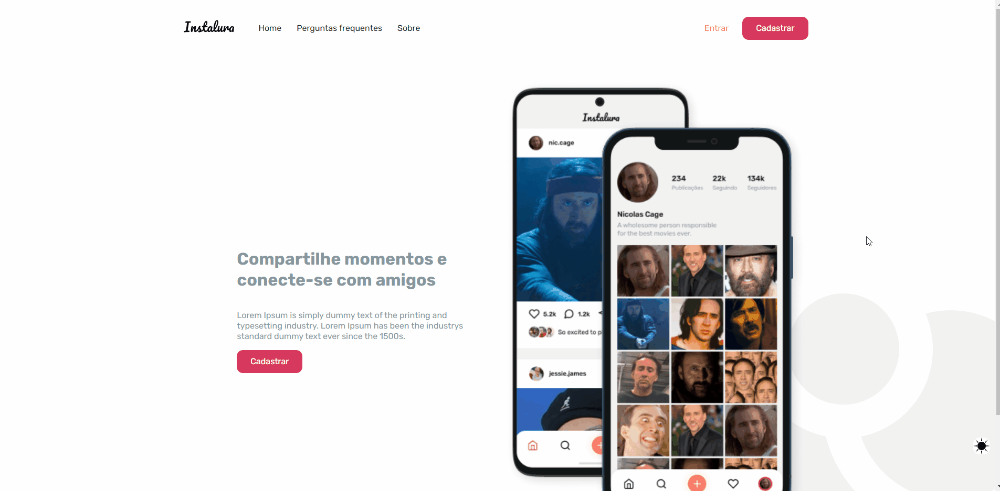
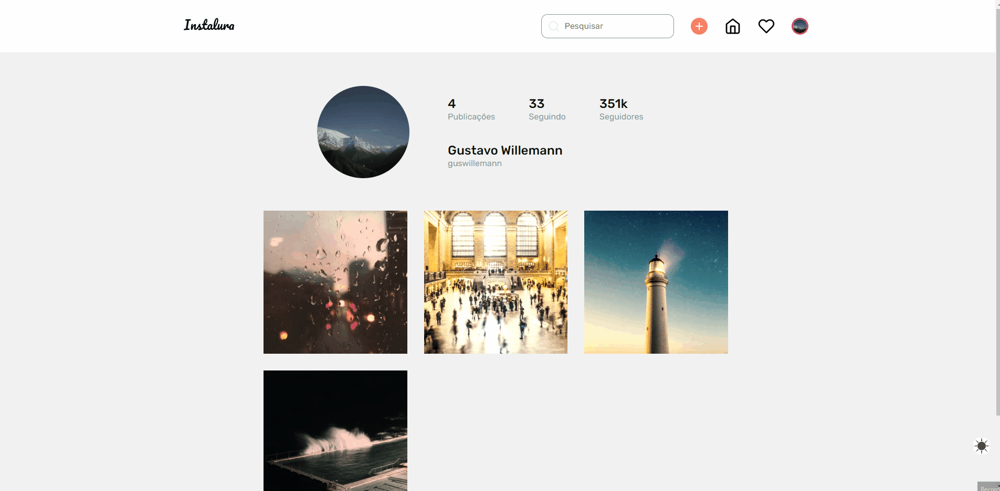
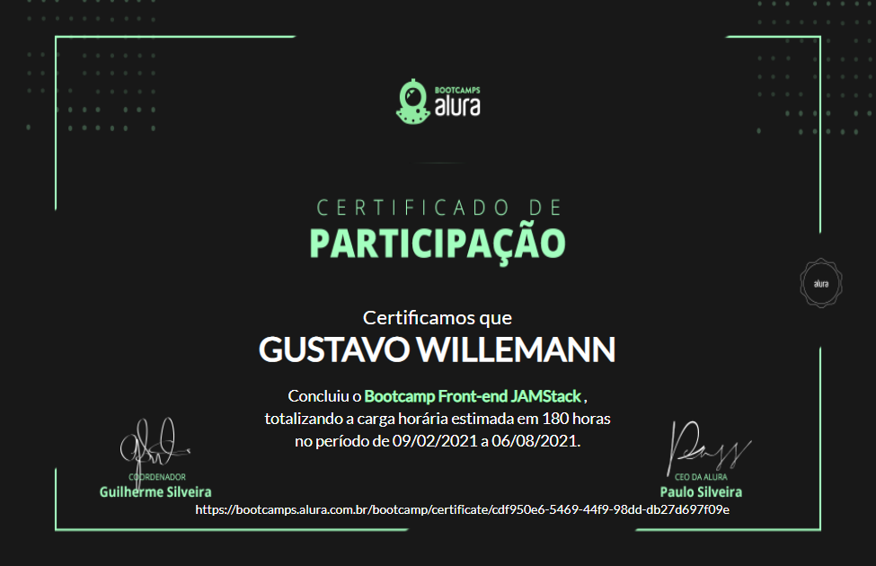

# Instalura

Project developed at [Alura](https://www.alura.com.br/)'s Front-End JAMStack Bootcamp, held between February and August 2021.

Project deploy: [https://instalura.guswillemann.vercel.app/](https://instalura.guswillemann.vercel.app/)

## 🧪 Technologies

- [React](https://reactjs.org/)
- [NextJS](https://nextjs.org/)
- [Styled Components](https://styled-components.com/)
- [Jest](https://jestjs.io/)
- [Cypress](https://www.cypress.io/)
- [DatoCMS](https://www.datocms.com/)

 

## 📚 The Course

In the Bootcamp classes, it was built the basic structure for the app. Wich includes the public pages and the code to enable the app's functionalities, like integration with the authentication back-end and the headless cms (DatoCMS).

At the end of the lessons, the app had all the public pages and the process of registration and login:

 

## 🏆 The Challenge

There was a challenge at the end of the Bootcamp. It was to build the app profile page and its functionalities of creating a new post and liking the available ones:

 

## 📜 Certificate

